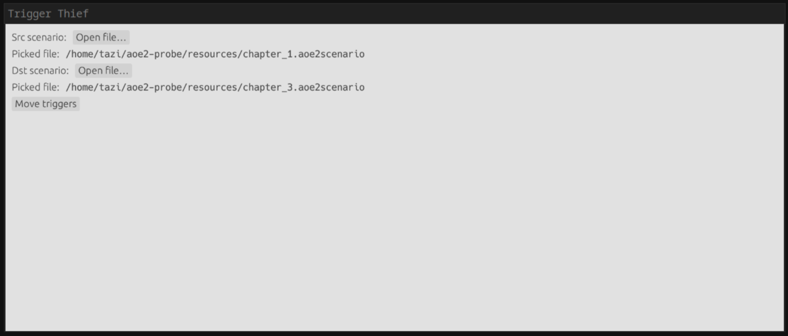
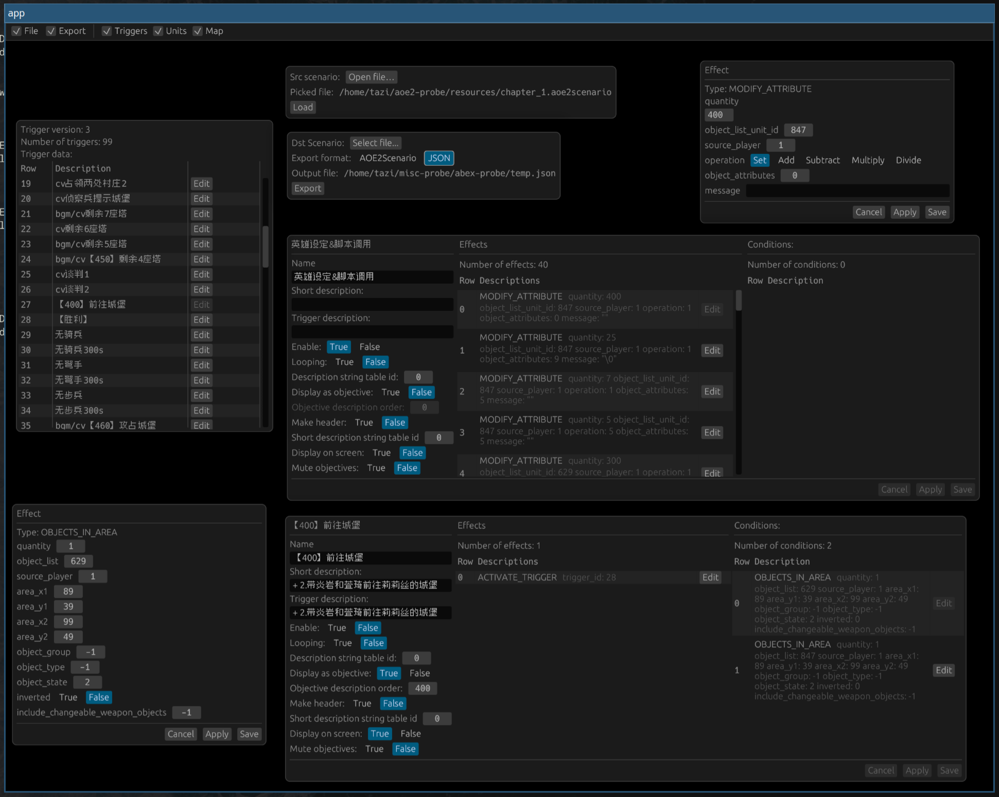

# misc-probe
Several mini-applications built on top of [aoe2-probe](https://github.com/ptazithos/aoe2-probe)


## Applications

### Trigger Thief
[[aoe2-probe](https://github.com/ptazithos/aoe2-probe) + [egui](https://github.com/emilk/egui)]\
A GUI program copies triggers from one to another.



### Abex Probe
[[aoe2-probe](https://github.com/ptazithos/aoe2-probe) + [bevy](https://github.com/bevyengine/bevy) + [bevy-egui](https://github.com/mvlabat/bevy_egui)]\
A simple scenario editor. 



## Getting Started
Run applications with following commands:
```shell 
cargo run -p [application-name]
```

